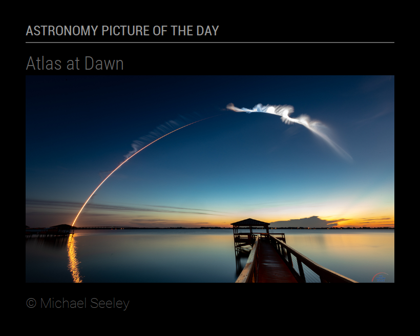
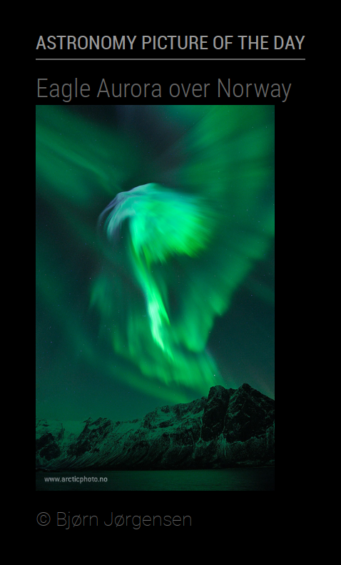
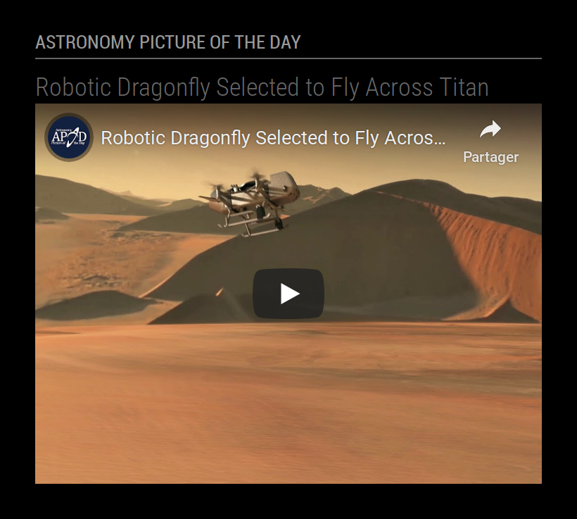
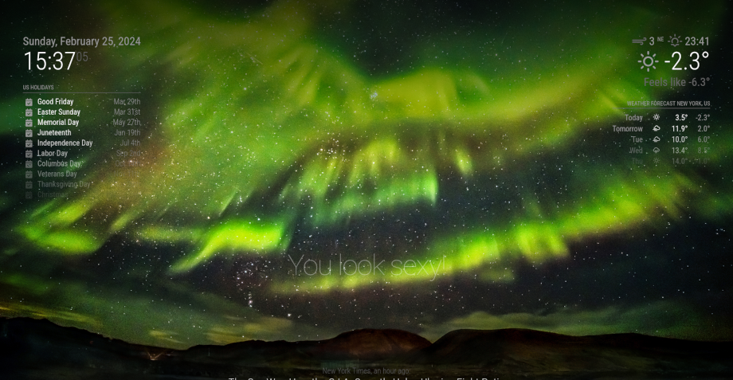

# Module: MMM-APOD

This module displays the last Astronomy Picture Of the Day (APOD), including media (image or video), title, description and copyright.

The max-height and max-width of the media can be fixed. Title and description display may be enabled or disabled independently. Description can be shorted and lenght can be fixed.

<p align="left">



</p>

MMM-APOD can be used to display the image in the background of [MagicMirror²](https://magicmirror.builders/) with `position: "fullscreen_below"`! Overlay image can be customized.

<p align="left">

</p>

[MagicMirror² on Github](https://github.com/MagicMirrorOrg/MagicMirror) | [APOD on NASA](https://apod.nasa.gov/)

## Installation

In your terminal, go to your MagicMirror's Module folder:

```shell
cd ~/MagicMirror/modules
```

Clone this repository:

```shell
git clone https://github.com/grenagit/MMM-APOD
```

Configure the module in your config.js file.

## Update

In your terminal, go to your MMM-APOD's Module folder:

```shell
cd ~/MagicMirror/modules/MMM-APOD
```

Incorporate changes from this repository:

```shell
git pull
```

## Configuration

### Basic configuration

To use this module, add it to the modules array in the `config/config.js` file:

```javascript
modules: [
	{
		module: "MMM-APOD",
		position: "top_left",
		config: {
			appid: "abcde12345abcde12345abcde12345ab" // NASA API key (api.nasa.gov)
		}
	}
]
```

You can use the special `DEMO_KEY` API Key for your tests but it has much lower rate limits !

### Options

The following properties can be configured:

| Option                       | Description
| ---------------------------- | -----------
| `appid`                      | The [NASA](https://api.nasa.gov) API key, which can be obtained by [signing up](https://api.nasa.gov/index.html#apply-for-an-api-key) on NASA API portal. It's free! <br><br>  This value is **REQUIRED**
| `updateInterval`             | How often does the content needs to be fetched? (Milliseconds) <br><br> **Possible values:** `1000` - `86400000` <br> **Default value:** `6 * 60 * 60 * 1000` (6 hours)
| `animationSpeed`             | Speed of the update animation. (Milliseconds) <br><br> **Possible values:**`0` - `5000` <br> **Default value:** `1000` (1 second)
| `maxMediaWidth`              | Maximum width for media display. If set to 0, the media's actual width is used. (Pixels) <br><br> **Possible values:**`0` - `5000` <br> **Default value:** `0` (media's width)
| `maxMediaHeight`             | Maximum height for media display. If set to 0, the media's actual height is used. (Pixels) <br><br> **Possible values:**`0` - `5000` <br> **Default value:** `0` (media's height)
| `maxDescriptionLength`       | Maximum length for short description display. <br> **Default value:** `200`
| `backgroundSize`             | Size of the background image [CSS property](https://developer.mozilla.org/docs/Web/CSS/background-size). <br><br> **Possible values:** `'contain'`, `'cover'` <br> **Default value:** `'cover'`
| `backgroundPosition`         | Position of the background image [CSS property](https://developer.mozilla.org/docs/Web/CSS/background-position).  <br><br> **Possible values:** `'top'`, `'bottom'`, `'left'`, `'right'`, `'center'` <br> **Default value:** `'center'`
| `backgroundOverlay`          | Overlay of the background image [CSS property](https://developer.mozilla.org/docs/Web/CSS/background).  <br><br> **Possible values:** `'rgba(0, 0, 0, 0.5)'` <br> **Default value:** `'linear-gradient(to bottom, rgba(0, 0, 0, 0.75) 0%, rgba(0, 0, 0, 0) 40%, rgba(0, 0, 0, 0) 80%, rgba(0, 0, 0, 0.75) 100%)'`
| `showTitle`                  | Show the title. <br><br> **Possible values:** `true` or `false` <br> **Default value:** `true`
| `showDescription`            | Show the description. <br><br> **Possible values:** `true` or `false` <br> **Default value:** `false`
| `useShortDescription`        | Short the description. <br><br> **Possible values:** `true` or `false` <br> **Default value:** `true`
| `initialLoadDelay`           | The initial delay before loading. If you have multiple modules that use the same API key, you might want to delay one of the requests. (Milliseconds) <br><br> **Possible values:** `1000` - `5000` <br> **Default value:**  `0`
| `retryDelay`                 | The delay before retrying after a request failure. (Milliseconds) <br><br> **Possible values:** `1000` - `60000` <br> **Default value:**  `2500`
| `apiBase`                    | The NASA API base URL. <br><br> **Default value:**  `'https://api.nasa.gov/'`
| `apodEndpoint`               | The APOD API endPoint. <br><br> **Default value:**  `'planetary/apod'`

### Todo

- [x] Create a function to summarize the description
- [x] Add an error message if the rate limit is exceeded.

### License

This module is licensed under the MIT License
